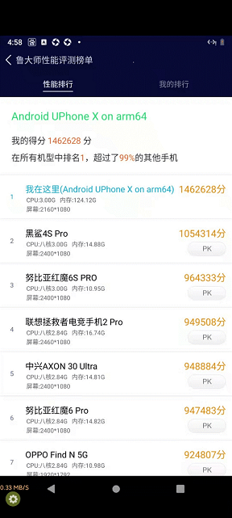

<!--建议复杂操作配图说明-->
# 功能和优势
### 突破算力瓶颈

   采用ARM服务器和GPU渲染，突破传统手机和SoC云手机的硬件算力瓶颈，可运行耗算力的安卓应用，亦可基于此设计长期的原生安卓云游戏、规划元宇宙的长期演进路线。
   下图为4核云手机性能评测第一。
* 

### 高灵活度

   区别于SoC云手机架构，客户可以对整台服务器进行切割，可任意的切割为1C1G或20C80G等各种规格的云手机。
   
### 高性能

   传统x86 CPU模拟安卓应用的ARM指令会有20%-30%的开销，而采用EmuGL实现OpenGLES到OpenGL的指令转换，存在性能损耗大、延迟大、卡顿等核心体验问题；
   UCloud云手机采用服务器级别3.0GHZ ARM CPU、自研安卓虚拟化技术、GPU直通安卓技术和内核调优等技术，小实例云主机可高效运行30-48路云手机应用。
   
### 独立IP与出海
   UCloud云手机支持群控、一键新机和独立IP功能，也支持海外云手机，可帮助中国企业实现电商出海，让中国制造走向世界。
